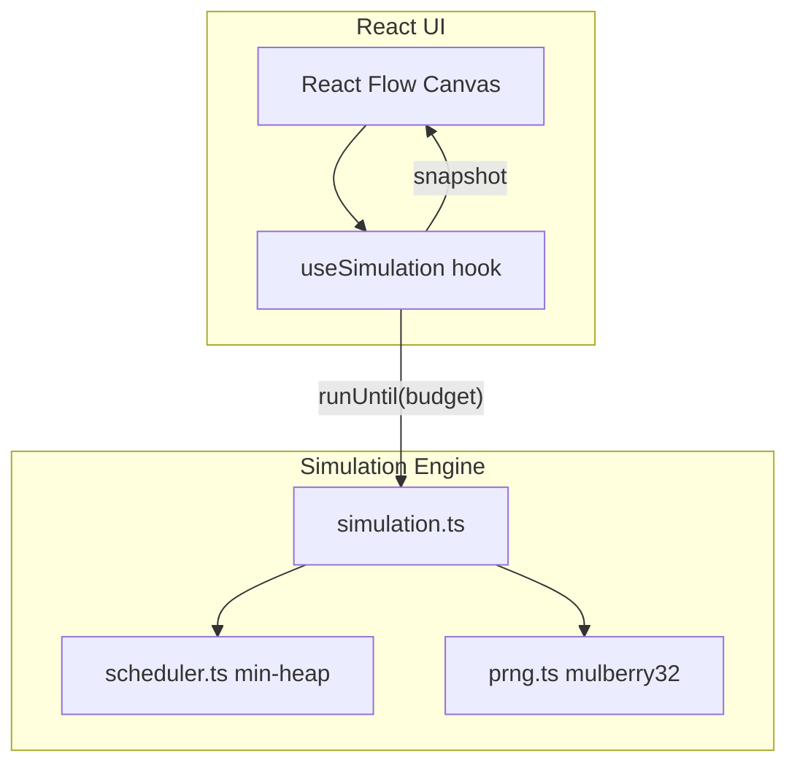

# Cascade

A browser-based, composable distributed-systems failure simulator. Drag service nodes onto a canvas, configure resilience policies, inject faults, and watch emergent failures unfold in real time — entirely client-side with deterministic, seed-based simulation.

## Quick start

```bash
npm install
npm run dev
```

```bash
npm run build    # production build
npm run smoke    # determinism + retry storm check
npm run benchmark
```

Deploy to Vercel:

```bash
npm run build && vercel deploy
```

## Architecture

Cascade separates a **pure TypeScript simulation engine** from a **React Flow UI**. The UI runs the engine as fast as possible via `requestAnimationFrame`, advancing virtual time by a speed multiplier each frame. No `setTimeout` or `setInterval` is used inside the simulation.



### Event scheduler

Every simulation action is a discrete event in a **min-heap priority queue** ordered by `virtualTime`. When timestamps tie, events are ordered by `id` for reproducibility.

```mermaid
sequenceDiagram
  participant Loop as rAF Loop
  participant Sim as Simulation
  participant Heap as EventQueue

  Loop->>Sim: runUntil(virtualTime + budget)
  loop while nextEvent.time <= budget
    Sim->>Heap: pop()
    Sim->>Sim: processEvent()
    Sim->>Heap: push(newEvents)
  end
  Loop->>Loop: render snapshot
```

Event types: `MESSAGE_SEND`, `MESSAGE_ARRIVE`, `MESSAGE_TIMEOUT`, `RETRY_SCHEDULED`, `CIRCUIT_PROBE`, `FAULT_INJECT`, `FAULT_CLEAR`.

## How retry storms emerge

Retry storms are **not hardcoded**. They emerge from the interaction of:

1. **Timeouts** — If downstream latency exceeds a node's `timeoutMs`, the message fails.
2. **Retry budget** — The calling node re-enqueues `MESSAGE_SEND` after exponential backoff + seeded jitter.
3. **Load generation** — The load balancer keeps issuing new requests independently.

When Service B becomes slow, Service A's requests time out. Each timeout schedules a retry. Retries add more load on B while the load balancer continues sending fresh requests. Failed-request amplification grows organically from the model.

## Pre-built scenarios

| Scenario | Topology | Failure mode |
|----------|----------|--------------|
| Retry Storm | LB → A → B | Latency on B amplifies retries from A |
| Cascading Failure | LB → A → B → DB | DB failure propagates upstream |
| Circuit Breaker Recovery | LB → Service → DB | DB fails, recovers; circuit opens → half-open → closed |
| Thundering Herd | LB → 3 Services → DB | Simultaneous timeouts saturate DB queue |
| Queue Saturation | LB → Service → DB | Small queue depth causes rejections |

## URL sharing

The full scenario (topology, config, seed, fault timeline) is serialized to base64url in the `?s=` query param. Loading a shared URL restores the exact scenario with no backend.

## Benchmark

Run headless:

```bash
npm run benchmark
```

On a typical dev machine the engine processes **~50k events/sec** when run without React rendering overhead (`npm run benchmark`). The UI decouples simulation steps from render frames so 50x speed stays smooth.

## Project structure

```
src/
  engine/       # Pure TS: scheduler, PRNG, nodes, messages, simulation
  components/   # React Flow canvas, panels, controls
  scenarios/    # Five pre-built failure scenarios
  hooks/        # useSimulation bridge
  utils/        # URL state encode/decode
```

## Tech stack

- React 18 + TypeScript (strict)
- React Flow
- Tailwind CSS
- Vite
- No backend, no database, no external simulation libraries
