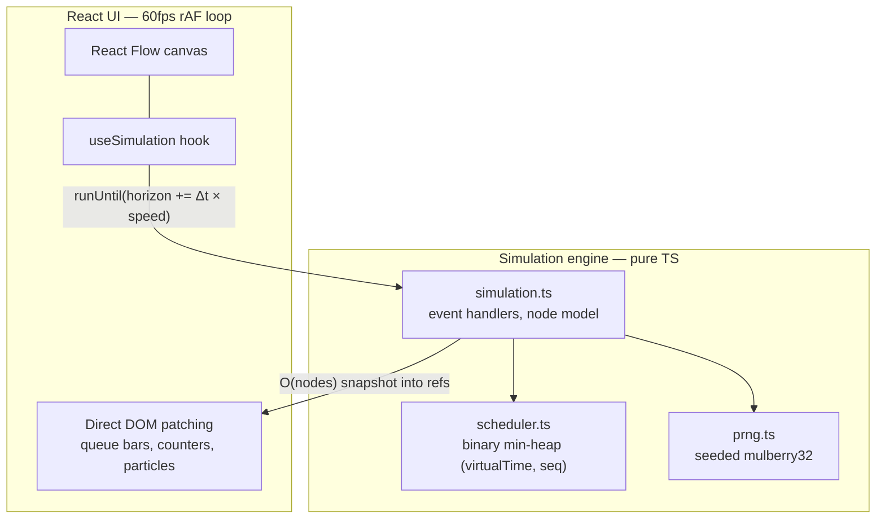
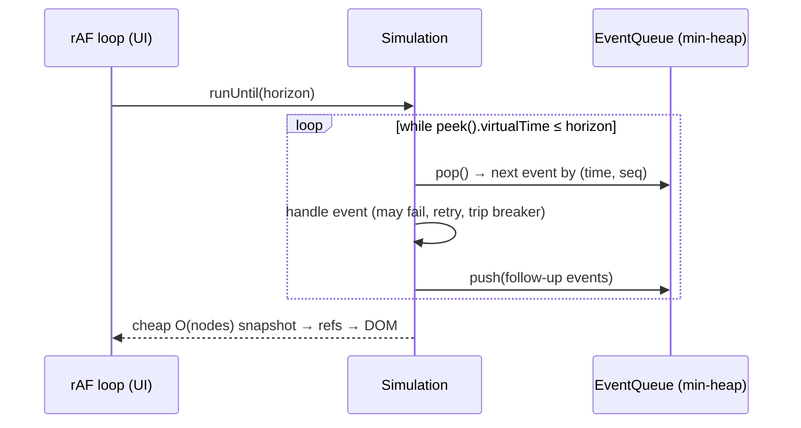

# Cascade

A browser-based, deterministic distributed-systems failure simulator. Drag service nodes onto a canvas, configure resilience policies (retry budgets, timeouts, circuit breakers, queue depths), inject faults, and watch retry storms and cascading failures **emerge** from the model — entirely client-side, no backend.

Every failure mode in Cascade is emergent, not scripted: faults only flip a node into a `FAILED` or `SLOW` state. Everything else — retries piling up, breakers tripping, queues saturating, failures cascading upstream — falls out of the interaction between concurrency limits, timeouts, and retry policies.

## Quick start

```bash
npm install
npm run dev        # opens on a live Retry Storm simulation
```

```bash
npm test           # 28 tests: heap ordering, determinism, emergence, URL round-trip
npm run smoke      # fast determinism + retry-amplification check
npm run benchmark  # raw engine throughput (events/sec)
npm run speed-test # speed-multiplier accuracy + 50x per-frame compute budget
```

## Architecture

A **pure TypeScript discrete-event engine** (`src/engine/`, zero dependencies, no DOM) sits under a **React Flow UI**. The engine has no concept of wall-clock time — `setTimeout`/`Date.now`/`Math.random` never appear inside it.



### The event scheduler

Every action is a discrete event in a **binary min-heap** keyed by `(virtualTime, seq)`:

- `virtualTime` — when the event happens in simulated milliseconds.
- `seq` — a monotonic insertion counter that breaks timestamp ties **FIFO**. Two events scheduled for the same instant always process in the order they were created, on every run, in every browser.

Event types: `MESSAGE_SEND`, `MESSAGE_ARRIVE`, `MESSAGE_TIMEOUT`, `RETRY_SCHEDULED`, `CIRCUIT_PROBE`, `FAULT_INJECT`, `FAULT_CLEAR`, plus recurring load generation.



The render loop advances a virtual-time horizon by `frameDelta × speedMultiplier` each frame and drains the heap up to it. Simulation stepping and React rendering are fully decoupled: per-frame state flows through refs and direct DOM patching, with React re-renders reserved for topology changes and low-frequency stats (~2.5 Hz).

### Determinism guarantee

Same seed + same topology ⇒ **identical event sequence and identical final state**, verified by test, not by assertion:

- All randomness (latency jitter, retry backoff jitter) comes from a seeded **mulberry32** PRNG. No `Math.random`, no `Date.now` in the engine.
- Timestamp ties break on a monotonic `seq` counter — never on map iteration order or string comparison.
- Event and message IDs come from per-instance counters, so two `Simulation` instances can't contaminate each other.

`src/engine/__tests__/determinism.test.ts` runs every scenario twice per seed and asserts the **full ordered event trace** (`time|seq|type` per event) and a fingerprint of final state (every node's circuit state, in-flight count, queue depth, and stats) are identical — plus divergence across different seeds, independence across interleaved instances, and exact reproduction after `reset()`.

## How retry storms emerge

Nothing in the engine says "now do a retry storm." The Retry Storm scenario injects exactly one thing: at t=200ms, Service B's processing latency rises to 500ms. Then:

1. **Timeouts fire** — A's calls to B now exceed A's 400ms timeout. Each timeout marks the message failed at the caller.
2. **Retries amplify load** — A has `retryBudget: 3`, so each failure re-enqueues the message after exponential backoff with seeded jitter (50ms base, 2s cap). B is still slow, so retries also time out — and each original request has become up to 4 attempts.
3. **The breaker trips** — B's consecutive failures cross `cbFailureThreshold`, its circuit opens, and it starts rejecting instantly. Rejections propagate as failures back to the load balancer, which is still generating 20 req/s of fresh load.

Measured from the actual scenario (seed 42): serviceA logs **14 retries**, serviceB's breaker cycles CLOSED → OPEN → HALF_OPEN and rejects **96 requests** in 5 simulated seconds. Run the control experiment yourself — the emergence test suite runs the identical topology with the fault removed and asserts zero retries and ~100% success.

The same mechanics produce the other failure modes: three services timing out in sync create a thundering herd (each retries 4×, saturating the shared DB queue at its depth of 5); a dead database cascades failures through two hops back to the edge.

## Pre-built scenarios

All five load from the menu, autoplay, and are verified by `emergence.test.ts` to demonstrate their failure mode (numbers below are seed-exact engine measurements):

| Scenario | Topology | Measured signature |
|----------|----------|--------------------|
| Retry Storm | LB → A → B | A retries 14×; B: CLOSED→OPEN→HALF_OPEN, 96 rejections |
| Cascading Failure | LB → A → B → DB | DB breaker opens; 72 rejections propagate; LB sees 72 failures vs 3 successes |
| Circuit Breaker Recovery | LB → Svc → DB | Full CLOSED→OPEN→HALF_OPEN→CLOSED cycle; traffic recovers after heal |
| Thundering Herd | LB → 3 Svcs → DB | Synchronized timeouts; each service retries 4×; DB queue pinned at depth 5 |
| Queue Saturation | LB → Svc → DB | DB rejects 199 requests; queue bar maxed for the whole run |

## URL sharing

The full scenario — topology, node configs, positions, seed, fault timeline — serializes to base64url in the `?s=` query param. `urlState.test.ts` verifies the round-trip two ways: the decoded state deep-equals the original, **and** a simulation built from the decoded URL produces a byte-identical event trace to one built from the source scenario.

## Measured performance

All numbers measured on Apple M4 Pro, Node v22 (`npm run benchmark` / `npm run speed-test`); the engine is pure TS so browser numbers are comparable.

| Metric | Result |
|--------|--------|
| Raw engine throughput | **~360,000–377,000 events/sec** (3 runs: 361,339 / 377,165 / 361,088 — Retry Storm, 10s virtual) |
| 50x speed, per-frame compute | **max 0.72ms, avg 0.05ms** against a 16ms frame budget (600 frames, Thundering Herd) |
| Speed multiplier accuracy | 10x → 10.1x, 50x → 50.5x measured virtual-time advance |

At 50x speed the simulation uses under 5% of the frame budget, so the animation loop never drops frames on sim compute. Per-frame snapshot cost is O(nodes + in-flight messages) — terminal messages are pruned from the engine, so cost stays flat no matter how long a run goes. Particle rendering is capped at 80 SVG elements per frame.

*Not measured*: real-browser paint FPS (verified headlessly only); throughput scales with topology size, and the figure above is for the 3-node Retry Storm graph.

## Project structure

```
src/
  engine/         # Pure TS: min-heap scheduler, PRNG, node model, simulation
    __tests__/    # heap ordering, determinism, emergence tests
  scenarios/      # Five pre-built failure scenarios + topology builder
  hooks/          # useSimulation — rAF loop, refs bridge, URL persistence
  components/     # React Flow canvas, particle overlay, panels, controls
  utils/          # URL state encode/decode (+ round-trip tests)
```

## Tech stack

React 19 · TypeScript (strict) · React Flow · Tailwind CSS · Vite. No backend, no database, no simulation libraries — the engine is ~1,100 lines of hand-written TypeScript.
